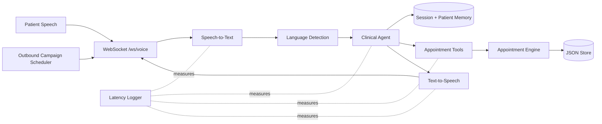

# Real-Time Multilingual Clinical Voice AI Agent

This repo implements a FastAPI voice-agent backend for clinical appointment booking, rescheduling, cancellation, availability checks, contextual memory, outbound campaign tasks, and per-turn latency logging.

The local demo uses mock STT/TTS so it runs without paid API keys. The modules are intentionally provider-shaped, so real Whisper/OpenAI/Redis/Postgres integrations can replace the default services without changing the WebSocket or appointment flow.

## Features

- Real-time JSON/WebSocket voice pipeline at `/ws/voice/{session_id}/{patient_id}`
- REST demo endpoint at `/voice/turn`
- Appointment booking, cancellation, rescheduling, conflict detection, and alternatives
- English, Hindi, and Tamil language detection with localized clarification prompts
- Session memory and patient persistent memory
- Outbound campaign task queue for reminders, follow-ups, and vaccination calls
- Latency logging for STT, agent reasoning, tool execution, TTS, and total response time

## Setup

```bash
python -m venv .venv
.\.venv\Scripts\activate
pip install -e ".[dev]"
python -m uvicorn backend.main:app --reload
```

Open `http://localhost:8000/docs` for the interactive API docs.

Docker:

```bash
docker compose up --build
```

## Demo Request

```bash
curl -X POST http://localhost:8000/voice/turn ^
  -H "Content-Type: application/json" ^
  -d "{\"session_id\":\"demo\",\"patient_id\":\"pat-1\",\"text\":\"Book appointment with cardiologist tomorrow at 10:30\"}"
```

Hindi clarification example:

```bash
curl -X POST http://localhost:8000/voice/turn ^
  -H "Content-Type: application/json" ^
  -d "{\"session_id\":\"demo-hi\",\"patient_id\":\"pat-2\",\"text\":\"मुझे कल दिल के डॉक्टर से मिलना है\"}"
```

## Architecture



The Mermaid source is also in `docs/architecture.mmd` and can be exported to PNG/PDF for submission.

## Memory Design

Session memory stores the current conversation state by `session_id`, including pending intent and collected fields such as specialty, date, time, and appointment ID.

Persistent memory stores patient preferences and history by `patient_id`, including preferred language and past appointment IDs.

The default implementation uses `data/store.json`. In production, map the same `MemoryStore` interface to Redis for session TTLs and PostgreSQL for durable appointment and patient records.

## Latency

Every voice turn writes a JSON line to `logs/latency.jsonl`:

```json
{
  "intent": "book",
  "latency": {
    "stt_ms": 0.02,
    "agent_ms": 0.31,
    "tools_ms": 1.4,
    "tts_ms": 0.03,
    "total_ms": 1.76,
    "under_450ms": true
  }
}
```

The mock provider path is expected to stay below 450 ms. Real deployments should use streaming STT, a low-latency tool-calling model, cached patient context, and streaming TTS to preserve this target.

## Trade-Offs

- Mock STT/TTS keeps the repository runnable without credentials, but it does not process real audio.
- The deterministic agent is easier to test than a live LLM. A production build can replace `ClinicalAgent.decide` with model tool-calling while preserving the same `AgentDecision` contract.
- JSON storage is simple for demos. Redis and PostgreSQL are recommended for concurrent production traffic.

## Known Limitations

- Date and time parsing covers common demo phrases, ISO dates, and simple AM/PM slots.
- Translated final confirmations are template-assisted, not full neural translation.
- Outbound campaigns are queued tasks only; telephony integration such as Twilio or SIP is not included.

## Tests

```bash
python -m pytest
```
